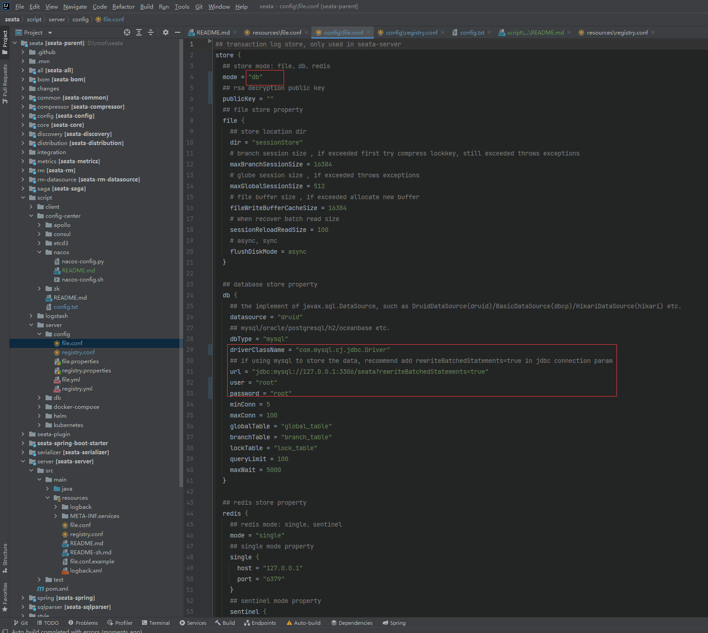
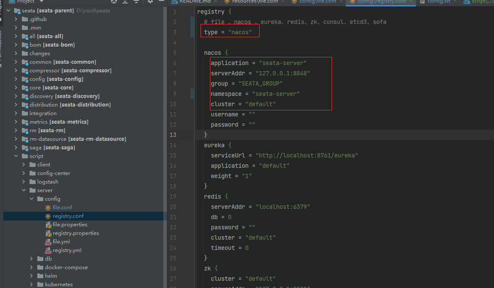
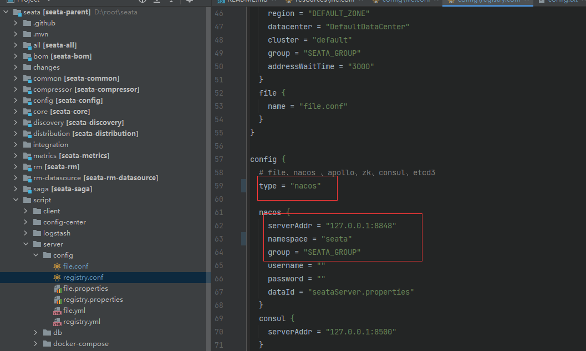
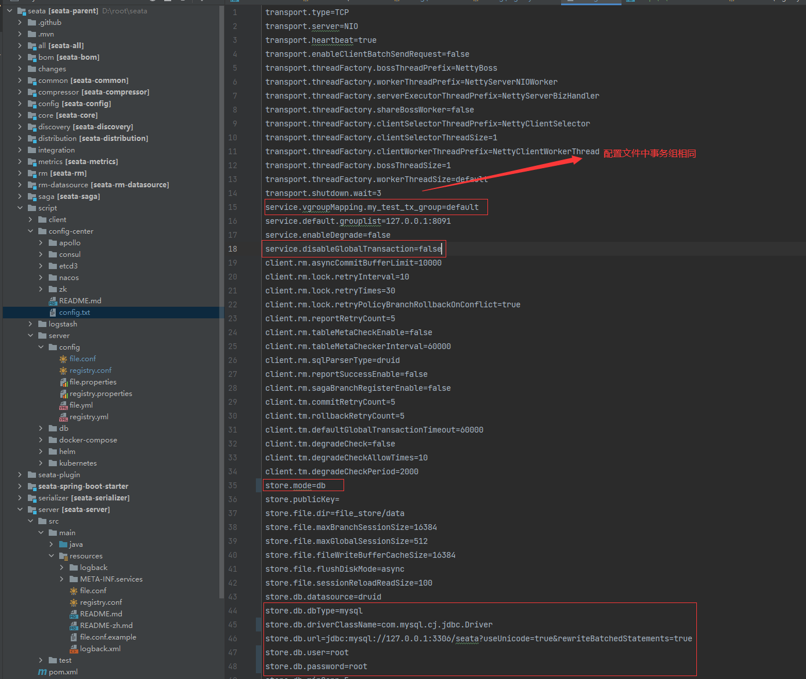
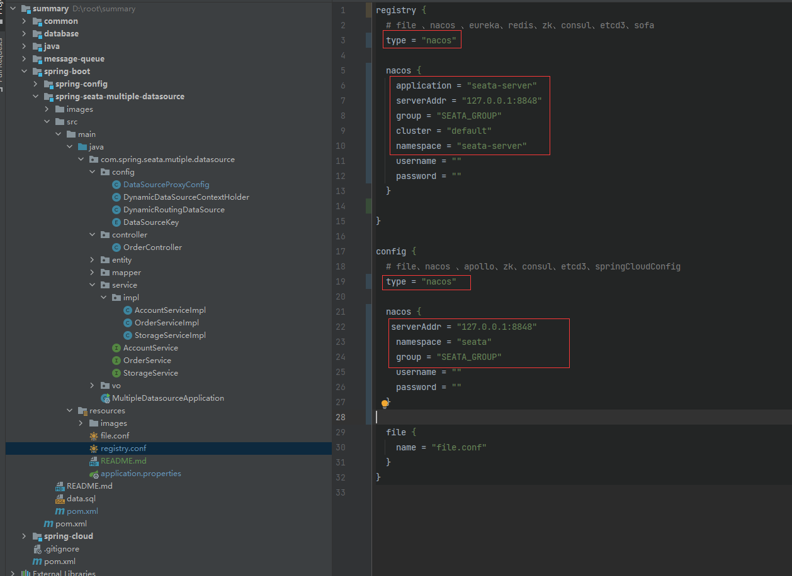
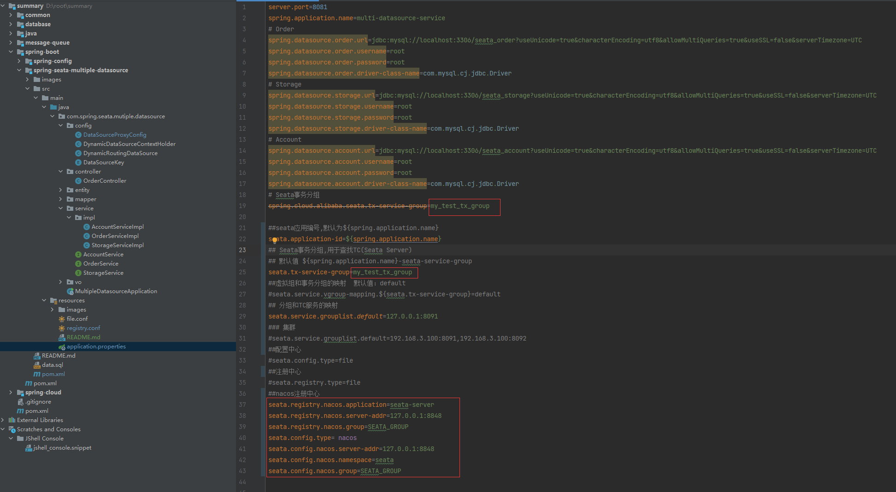

# 1 seata-server 搭建 

## 1.1 下载 jar 包

[下载可运行的 jar 包](https://github.com/seata/seata/releases)

## 1.2 修改 conf/file.conf

## 1.3 修改 register.conf

使用本地 file 作为注册中心和配置中心无须更改任何配置，直接启动即可.

nacos 

config

## 1.4 上传配置文件到 nacos

    # 上传脚本到配置中心
    sh nacos-config.sh -h localhost -p 8848 -g SEATA_GROUP -t seata

# 2 client 客户端使用

配置文件修改

http://note.youdao.com/noteshare?id=b705e56b9e7b945c1dea6fa39fe3db45&sub=5618BA2C6EC24D819530AF995039C8BA